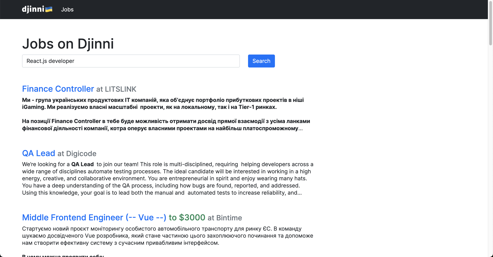

# Djinni test task

В даному репозиторії знаходиться sandbox-проєкт Djinni Jobs, який відображає список 15к вакансій. Це є тестова репліка на [djinni.co/jobs](https://djinni.co/jobs/)     

**_ПРИМІТКА: Дані по вакансіях використані у тестовому проєкті реальні, лише компанії та зарплати були модифіковані під тестове завдання._**

## Завдання

### Зробити функцію пошуку вакансій

Функціональність пошуку має включати але може не обмежуватись такими параметрами:
- по заголовку (position) та опису (long_description)
- за ключовими словами, категорією (primary_keyword, secondary_keyword, extra_keywords)
- за зарплатнею (salary_min, salary_max)
- за видом роботи Офіс/Віддалено (remote_type)
- за країною (country) та містом (location)
- за рівнем англійської (english_level)
- за роками досвіду (experience_years)
- по назві компанії (company.name)

Вид/дизайн фронтендової форми пошуку - на ваш розсуд.

#### Головні критерії оцінки завдання:
- Точність результатів до пошукового запиту
- Зручність та швидкість користування пошуком
- Читабельний/чистий код
 
Bonus points за продумане відображення результатів пошуку в інтерфейсі.

#### Деякі запити/скарги наших користувачів щодо пошуку  

Ви можете використати їх для того щоби краще зорієнтувати свій скоуп:

- **Неточний пошук за категоріями**: деякі вакансії не видно в пошуку по категоріях або навпаки вакансії з інших категорій попадають в результат
- **Додайте можливість додавати блок слова**: наприклад, я шукаю AQA Python, але не Java. Або треба виключити Fullstack вакансії зі списку.
- **Коли шукаю по технології "Solidity", попадаються вакансії із словом SOLID в описі**
- **Хочу фільтрувати вакансії по доменах та по аутсорс/продукт**
- **Дозвольте сортувати вакансії по відгуках та по даті публікації**

Також ви можете самостійно проглянути наш форум [Nolt](https://djinni.nolt.io/) і пошукати запити від користувачів там.

#### DOs/DONTs

👍 DOs:
- Можете модифікувати/додавати моделі
- Встановлювати та використовувати будь-які додаткові фронтенд/бекенд модулі або сервіси. Якщо потрібно, додайте інструкцію інсталяції
- Ви можете модифікувати темлейт `templates/jobs/list.html` як забажаєте

🚫 DONTs:
- використовувати дані поза межами цього тестового без дозволу Djinni
- не треба модифікувати `templates/base.html`

Щоби запостити ваше виконане тестове завдання, зробіть fork цього репозиторію та відкрийте PR із вашими змінами.
Якщо будуть питання - звертайтесь в тг до автора цього завдання [@ovvshiee](https://t.me/ovvshieee).

## Installation

### Prerequisites

- Docker: Engine: v27 Compose: v2.28

### Local setup

#### 1. Clone this repo

```
git clone git@github.com:djinni-co/djinni-jobs-test.git
cd djinni-jobs-test
```

#### 2. Create the `.env` file:

```
cp .env.example .env
```

#### 3. Build and run the docker container:

```
docker compose build
docker compose up
```

If installation succeed you will see the following in the console:
```
web-1  | Django version 4.2.4, using settings 'djinnitest.settings'
web-1  | Starting development server at http://0.0.0.0:8000/
web-1  | Quit the server with CONTROL-C.
```

#### 4. Run migrations

```
docker compose exec web python3 app/manage.py migrate
```

#### 5. Import database  

See active containers list:  

```
docker ps
```
```
CONTAINER ID   IMAGE             COMMAND                  CREATED          STATUS         PORTS                    NAMES
ba15bc763d0b   djinnitest-web    "python app/manage.p…"   16 minutes ago   Up 5 minutes   0.0.0.0:8000->8000/tcp   djinnitest-web-1
8c7c57d12f01   postgres:latest   "docker-entrypoint.s…"   2 hours ago      Up 5 minutes   
```

In this example the **8c7c57d12f01** is the `<CONTAINER ID>` of the **postgres** container.  
  
Replace `<CONTAINER ID>` with the id of the postgres container and run the command:

```
cat dump.sql | docker exec -i <CONTAINER ID> psql --user admin djinni_sandbox
```

Now open the http://0.0.0.0:8000 and you will see jobs list.

Good to go! 👍👍


